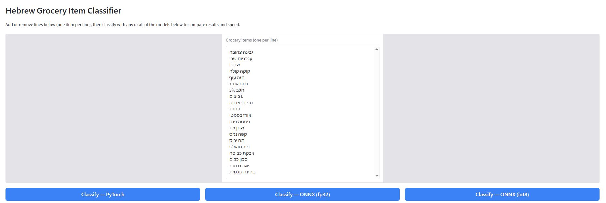
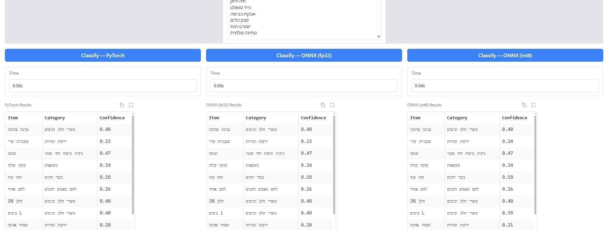

# 🛒 Hebrew Grocery Item Classifier

A machine learning web application that automatically classifies Hebrew grocery shopping list items into **12 supermarket categories**. 

This app is powered by the specialized, fine-tuned embedding model [davidit17/e5-grocery-finetuned-v2](https://huggingface.co/davidit17/e5-grocery-finetuned-v2) to handle native Hebrew text seamlessly.

## 🚀 Live Demo

You can try the live application directly on Hugging Face Spaces:
👉 **[Hebrew Grocery Classifier Space](https://huggingface.co/spaces/davidit17/classifier)**

---
## 📸 Interface Preview

<!-- First Image - Forced Larger Scale -->

  

<!-- Stylish Divider and Space -->

<!-- Second Image - Forced Larger Scale -->

  

